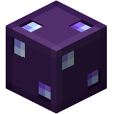

<h1 align="center">
   
  IQ Addons
</h1>

  <b>A Hypixel SkyBlock mod made especially for Kuudra</b> 
  Clean, minimal, and focused on what matters

 

---

## 🎯 What is IQ?

**IQ** is a lightweight Fabric mod designed to enhance your Kuudra experience on Hypixel SkyBlock. While it includes some general features, the core focus is on providing **useful, non-intrusive QoL improvements** for every phase of Kuudra runs.

From the very beginning, our goal has been to keep IQ **clean and minimal** — offering only useful features with no unnecessary clutter.

---

## ✨ Features

### Phase 1 — Supplies

<b>🎯 Pearl Waypoints</b>

 
Shows precise waypoints for pearl throws based on your position. Includes stand block indicators and timing labels.

- Automatically detects your current area
- Shows optimal pearl landing spots
- Displays recommended throw timing
- Fully customizable via JSON config

<b>📦 Supply Waypoints</b>

 
Draws beacon beams at supply crate locations carried by giants.

- Real-time tracking of supply carriers
- Customizable waypoint colors
- Automatic updates as giants move

<b>🏔️ Pile Waypoints</b>

 
Displays beacons at all crate pile locations.

- Highlights remaining piles
- Different color for "no pre" piles
- Automatically hides completed piles

<b>⏱️ Supply Timers</b>

 
Tracks and displays supply pickup times for all players.

- Shows player name and pickup time
- Color-coded based on speed
- Clean HUD overlay

<b>🔔 Supply Alerts</b>

 
Multiple alert systems to keep you informed:

- **No Pre Alert** — Automatically announces missing pre supplies to party chat
- **Already Picking Alert** — Shows title when someone else is picking your supply
- **Second Supply Alert** — Announces second supply position (Shop/X Cannon/Square)
- **Supply Recover Message** — Sends your custom chat message when you recover a supply
- **Supply Giant Hitbox Alert** — Highlights and alerts when you recover inside giant hitbox

<b>📈 Supply Progress Widget</b>

 
Replaces the default supply title with a clean, movable widget.

- Live 0/6 progress updates
- Better visibility than vanilla title spam
- Fully HUD-editable position

---

### Phase 2 — Build

<b>🏗️ Build Progress Overlay</b>

 
Displays a comprehensive build progress HUD.

- Current build percentage
- Fresh count tracker
- ETA estimation
- Color-coded progress bar

<b>🔥 Fresh Alerts & Timers</b>

 
Complete fresh tracking system:

- **Fresh Message** — Sends party message when you fresh (with build %)
- **Fresh Timers** — Renders countdown above fresher's heads
- **Fresh Countdown** — Personal HUD countdown for your fresh
- **Fresh Highlight** — Separate temporary glow override for players who are fresh

<b>👷 Build Helper Waypoints</b>

 
Shows beacon beams at build piles with progress-based colors.

- Red → Orange → Yellow → Green color progression
- Displays pile progress percentage
- Helps prioritize which piles need attention

<b>👤 Elle Highlight</b>

 
Draws a visible hitbox around Elle during the build phase for easy tracking.

<b>🔊 Ballista Build Sound Replace</b>

 
Replaces the default Ballista build sound during Phase 2 with IQ custom audio.

---

### Phase 3 — Stun

<b>💚 Kuudra HP Bossbar</b>

 
Custom health display for Kuudra.

- Shows current HP and percentage
- Color-coded health bar
- Damage calculator during boss phase

<b>📍 Stun Waypoints</b>

 
Displays waypoints at optimal stun positions.

<b>🎯 Kuudra Hitbox</b>

 
Renders Kuudra's hitbox with a glowing outline for easier targeting.

- Customizable color
- Works through walls

<b>🚫 Block Useless Perks</b>

 
Prevents accidentally purchasing useless perks from the perk menu.

- Blocks: Steady Hands, Bomberman, Auto Revive, Human Cannonball, Elle's Lava Rod, Elle's Pickaxe

---

### Phase 4 — Boss Fight

<b>🧭 Kuudra Direction Alert</b>

 
Shows which direction Kuudra will spawn from.

- Color-coded direction indicator
- Large on-screen title alert

<b>⚔️ Rend Damage Tracker</b>

 
Tracks when teammates deal Rend damage to Kuudra.

- Shows damage amount
- Displays timing since boss start
- Color-coded damage tiers

<b>⚠️ Danger Zone Alert</b>

 
Alerts when you're standing on tentacle danger zones.

- **JUMP!** alert on yellow/orange/red terracotta
- Audio notification

<b>🦴 Backbone Alert</b>

 
Tracks Bonemerang backbone timing with on-screen progress and Rend sync alert.

<b>🙈 Hide Kuudra Damage Title</b>

 
Hides the vanilla Kuudra damage title (e.g. ☠ 240M/240M❤) for a cleaner boss screen.

---

### General Features

<b>📊 Custom Splits</b>

 
Comprehensive run timing display.

- Individual phase times with color grading
- Overall run time
- Pace estimation
- Customizable thresholds

<b>👥 Team Highlight</b>

 
Highlights your teammates with the normal glowing effect during runs.

- Distinguishes real players from NPCs
- Customizable highlight color

<b>💜 Mana Drain Notify</b>

 
Announces Extreme Focus mana usage to party chat with affected player count.

<b>🔔 Party Join Sound</b>

 
Plays a notification sound when someone joins your party.

<b>🔇 Hide Mob Nametags</b>

 
Prevents Kuudra mob nametags from rendering, reducing visual clutter.

<b>🏆 Personal Best Tracker</b>

 
Tracks your best Kuudra run time and notifies you when you beat your PB.

<b>💰 Kuudra Profit Tracker</b>

 
Calculates profit/loss per run with configurable pricing logic.

- Bazaar and Auction-aware pricing
- Includes keys, essence, books, armor and pet bonus adjustments
- Hourly rate and session tracking

<b>🧰 Chest Utilities</b>

 
Utility set for chest-focused runs.

- **Chest Value Display** — Shows chest value when opening reward chests
- **Chest Counter Tracker** — Tracks progress toward the 60 chest cap
- **Chest Counter Party Reminders** — Optional milestone/cap announcements in party chat
- **Croesus Helper** — Highlights already opened chests in Croesus/Vesuvius menus

<b>🔁 Auto Requeue</b>

 
Automatically queues the next Kuudra run after boss completion with configurable delay.

<b>📣 Kuudra Notifications</b>

 
Centralized event notifications for key run moments.

- Build started / build done
- Supplies done
- Ichor used
- Cannonball purchased
- No pre reminder
- SOS (pre-stun) reminder
- Phase change alerts
- Optional notification sound

<b>🪄 Ability Announce</b>

 
Announces selected ability casts in party chat.

- Spirit Spark
- Hollowed Rush
- Raging Wind
- Ichor Pool
- Mana Drain

<b>🎮 Party Commands</b>

 
Supports chat-based party commands triggered by `!` messages.

- Warp / transfer / promote / kick shortcuts
- Quick joininstance commands (`!t1` to `!t5`)
- Ping and TPS replies
- Share runs, chest progress, and profit stats in party chat

<b>👔 Wardrobe Keybinds</b>

 
Lets you swap Wardrobe sets instantly using configurable keybinds with optional sound feedback.

<b>🚨 Limbo Alert</b>

 
Detects SkyBlock limbo kicks and alerts your party automatically.

<b>🧹 Extra Visual Cleanup</b>

 
Additional clutter-reduction options for cleaner gameplay.

- Hide Kuudra vanilla boss bar
- Hide selected useless armor stands

---

## Pearl Waypoints Customization

Advanced users can edit `pearl_waypoints.json` to customize pearl throw locations. The mod will automatically reload changes.

---

## 💬 Support

Need help or have suggestions?

- 🐛 **Bug Reports:** Open an [issue on GitHub](https://github.com/pehenrii/IQ/issues)
- 💡 **Feature Requests:** Join our [Discord](https://discord.gg/HdhXhCWcW9)
- 💬 **General Help:** Ask in our Discord server

---

## 🤝 Contributing

Contributions are welcome! If you'd like to contribute:

1. Fork the repository
2. Create a feature branch (`git checkout -b feat/amazing-feature`)
3. Commit your changes (`git commit -m 'feat(amazing) add amazing feature'`)
4. Push to the branch (`git push origin feat/amazing-feature`)
5. Open a Pull Request

---

## 📜 License

This project is licensed under the **MIT License** — see the [LICENSE](LICENSE) file for details.

---

## 👥 Credits

<table>
  <tr>
    <td align="center"><b>PeHenrii</b> Lead Developer</td>
    <td align="center"><b>DarkJota</b> Mind behind the features</td>
  </tr>
</table>

---

  Made with ❤️ for the Kuudra community 
  ⭐ Star us on GitHub if you find this useful!

